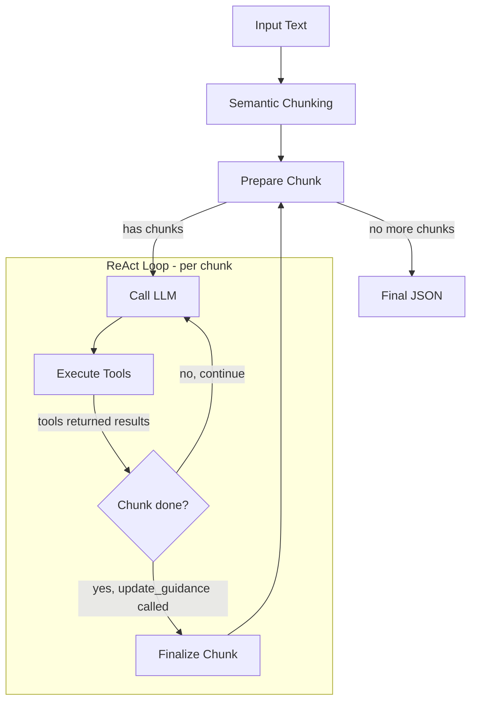

# Robust Text-to-JSON

LangGraph agent that transforms unstructured text into structured JSON via LLM — with no limits on input text length, output JSON size, or JSON complexity.

Works with or without a JSON Schema: provide one to enforce a specific structure, or let the agent infer one automatically from the content.

## Key Design Goals

- **Unlimited input size**: text is split into semantic chunks, each processed independently — the agent handles documents of any length.
- **Unlimited output size**: the JSON document grows incrementally via [JSON Patch (RFC 6902)](https://datatracker.ietf.org/doc/html/rfc6902) operations, so there is no upper bound on the generated JSON.
- **Hallucination mitigation**: multiple layers of validation prevent the LLM from fabricating or destroying data (see [Anti-Hallucination Safeguards](#anti-hallucination-safeguards)).
- **Schema optional**: a JSON Schema can guide extraction, but is not required — the agent infers structure when no schema is provided.

## Features

- **Semantic Chunking**: splits text into semantically coherent chunks using embeddings, with fallback to recursive character splitting.
- **Iterative ReAct Loop**: each chunk is processed through a Think → Act → Observe loop where the LLM uses tools to inspect, search, and modify the JSON document.
- **Incremental Construction**: the JSON document is built progressively with JSON Patch operations — each chunk adds to (or corrects) what previous chunks produced.
- **Cross-Chunk Continuity**: a _Guidance_ object carries context between chunks (open sections, pending data, expectations), so the agent seamlessly continues extraction across chunk boundaries.
- **Schema Validation**: when a schema is provided, every patch operation is validated against it — type checks, required fields, format validation, `$ref` resolution, `anyOf`/`oneOf`/`allOf` composition, and more.
- **Smart Truncation**: large documents and tool responses are intelligently truncated (strings, arrays, objects) to fit the LLM context window without losing critical structural information.
- **Rich CLI**: live progress visualization with Rich showing current chunk, iteration, tool usage, and token consumption.

## Anti-Hallucination Safeguards

The agent employs several mechanisms to prevent the LLM from hallucinating, duplicating, or destroying data:

| Mechanism                                 | Description                                                                                                                     |
| ----------------------------------------- | ------------------------------------------------------------------------------------------------------------------------------- |
| **Destructive overwrite detection** | Pre-validates patches to block `add` operations that would replace existing arrays or the entire document.                    |
| **Shrinkage guard**                 | Rejects patch batches that reduce the document size by more than 50%, catching accidental replacements of containers.           |
| **Type downgrade prevention**       | Blocks replacing an object/array with a scalar value, including `add` of a scalar on an existing array.                       |
| **Automatic deduplication**         | Before appending to an array, items are compared (canonical JSON) against existing entries and the current batch.               |
| **Mandatory duplicate check**       | `search_pointer` is described as mandatory before creating list items, so the LLM searches for existing entities first.       |
| **Schema enforcement**              | Every `add`/`replace` value is validated against the JSON Schema (type, format, required fields, `additionalProperties`). |
| **Prescriptive error messages**     | When a patch fails, the error message tells the LLM_exactly_ how to fix it (e.g., "use `/-` to append").                      |
| **Context trimming with retry**     | If the LLM stops producing tool calls (context full), old message rounds are trimmed and the call is retried.                   |
| **Forced tool calling**             | `tool_choice="required"` ensures the LLM always uses tools instead of generating free-form text.                              |

## Installation

```bash
# Using uv (recommended)
uv sync

# Or using pip
pip install -e .
```

## Configuration

Create a `.env` file in the project root:

```bash
OPENAI_API_KEY=sk-...

# Optional overrides (shown with defaults)
CHAT_MODEL=openai:gpt-4o-mini
EMBEDDING_MODEL=openai:text-embedding-3-small
MAX_ITERATIONS_PER_CHUNK=50
```

## Usage

### CLI

```bash
# Extract from direct text
text-to-json --text "John Doe, 30 years old, works at Acme Corp"

# Extract from file
text-to-json --file document.txt

# Use a specific JSON Schema
text-to-json --file doc.txt --schema schema.json

# Show live progress with Rich
text-to-json --file doc.txt --progress

# Save formatted result to file
text-to-json --file doc.txt --output result.json --pretty

# Limit iterations per chunk
text-to-json --file doc.txt --max-iterations 30
```

### Python API

```python
from text_to_json import extract
import rich

# Simple extraction (no schema — agent infers structure)

result = extract(
    text="John Doe, 30 years old, works at Acme Corp as an engineer.",
)
rich.print(result["json_document"])
# {'name': 'John Doe', 'age': 30, 'occupation': 'engineer', 'company': 'Acme Corp'}

# With a JSON Schema

schema = {
    "type": "object",
    "properties": {
        "employees": {
            "type": "array",
            "items": {
                "type": "object",
                "properties": {
                    "name": {"type": "string"},
                    "age": {"type": "integer"},
                    "company": {"type": "string"}
                },
                "required": ["name"]
            }
        }
    }
}

result = extract(
    text="""
    John Doe, 30 years old, works at Acme Corp as an engineer.
    Jane Smith, 25 years old, works at Blue Corp as a software engineer.
    Jim Beam, 35 years old, works at Green Corp as a marketing manager.
    Jill Johnson, 28 years old, works at Red Corp as a product manager.
    Jack Doe, 32 years old, works at Yellow Corp as a sales manager.
    Jane Doe, 27 years old, works at Blue Corp as a sales manager.
    Jim Doe, 33 years old, works at Green Corp as a sales manager.
    Jill Doe, 29 years old, works at Red Corp as a sales manager.
    """,
    schema=schema,
    show_progress=True,  # Rich live display
)

# Access extracted document

rich.print(result["json_document"])
# {
#    "employees": [
#        {"name": "John Doe", "age": 30, "company": "Acme Corp"},
#        {"name": "Jane Smith", "age": 25, "company": "Blue Corp"},
#        {"name": "Jim Beam", "age": 35, "company": "Green Corp"},
#        {"name": "Jill Johnson", "age": 28, "company": "Red Corp"},
#        {"name": "Jack Doe", "age": 32, "company": "Yellow Corp"},
#        {"name": "Jane Doe", "age": 27, "company": "Blue Corp"},
#        {"name": "Jim Doe", "age": 33, "company": "Green Corp"},
#        {"name": "Jill Doe", "age": 29, "company": "Red Corp"}
#    ]
# }

# Access metadata
rich.print(f"\nChunks processed:")
rich.print(result['metadata']['total_chunks'])
rich.print(f"\nToken usage:")
rich.print(result['metadata']['token_usage'])
```

## Architecture

The agent is built as a **LangGraph** state machine with the following flow:



**Processing flow:**

1. **Semantic Chunking** — The input text is split into semantically coherent chunks using embedding-based breakpoint detection. If semantic chunking fails, falls back to recursive character splitting.
2. **Prepare Chunk** — A new system prompt + user message is built for the chunk, including the current JSON skeleton (truncated), target schema, and guidance from the previous chunk.
3. **Call LLM** — The model receives the messages and responds with tool calls. If context is too large, old rounds are trimmed and the call is retried.
4. **Execute Tools** — Tool calls are dispatched, patches are validated and applied, and results are returned as `ToolMessage`s.
5. **Finalize Chunk** — When `update_guidance` is called, the chunk is marked as done and the guidance is saved for the next chunk.
6. **Final JSON** — When all chunks are processed, the accumulated JSON document is returned.

### Available Tools

| Tool                | Description                                                                                                                       |
| ------------------- | --------------------------------------------------------------------------------------------------------------------------------- |
| `inspect_keys`    | Returns keys of an object or length of an array at a JSON Pointer path. Supports both the document and the schema as source.      |
| `read_value`      | Reads the value at a specific JSON Pointer path, with configurable truncation for depth, string length, and array/object size.    |
| `search_pointer`  | Searches keys or values in the document/schema and returns matching JSON Pointers. Supports fuzzy matching.                       |
| `apply_patches`   | Applies a batch of RFC 6902 JSON Patch operations (add, replace, remove, move, copy) with full schema validation.                 |
| `update_guidance` | Finalizes the current chunk and creates a rich context object for the next chunk (sections snapshot, pending data, expectations). |

## Testing

Run the full test suite with pytest:

```bash
# Using uv
uv run pytest tests/ -v

# Or directly
pytest tests/ -v
```

## License

MIT
